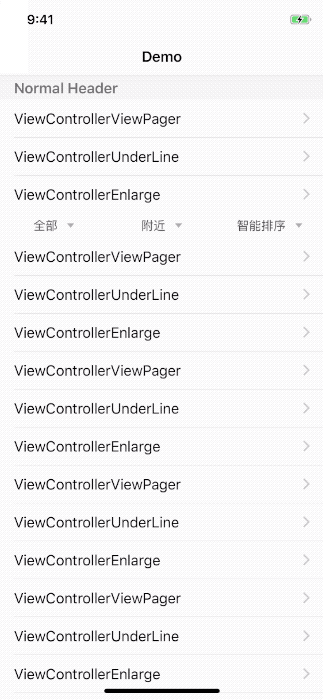

# LTDropDownMenu

### Drop down menu
The menu can be added to table headerView and when click it, the header will be move the top.

### Insatallation

	pod 'LTDropDownMenu'

### Usage

	 CGSize size = CGSizeMake([[UIScreen mainScreen] bounds].size.width, 28);
    LTDropDownMenu *menu = [LTDropDownMenu menuWithSize:size];
    [menu setMenuTitles:@[@"All", @"Near", @"Sort"]];
    menu.delegate = self;
    menu.dataSource = self;
    
    Implement delegate method
    - (void)menu:(LTDropDownMenu *)menu didSelectRow:(NSInteger)row;

    Implement datasource method
    - (NSString *)menu:(LTDropDownMenu *)menu titleForCol:(NSInteger)col row:(NSInteger)row;

    - (NSInteger)menu:(LTDropDownMenu *)menu numberOfRowsInCol:(NSInteger)col;

### Sample Image

